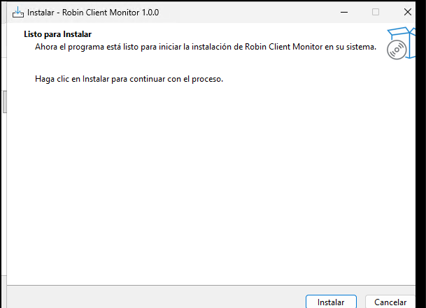
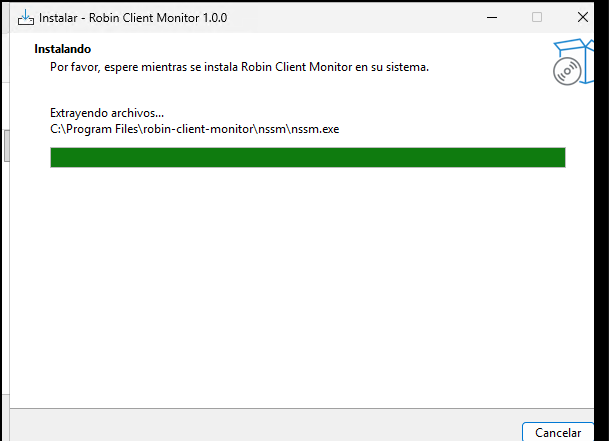
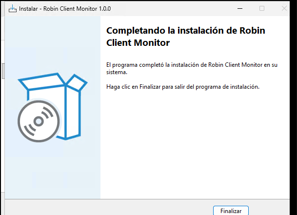
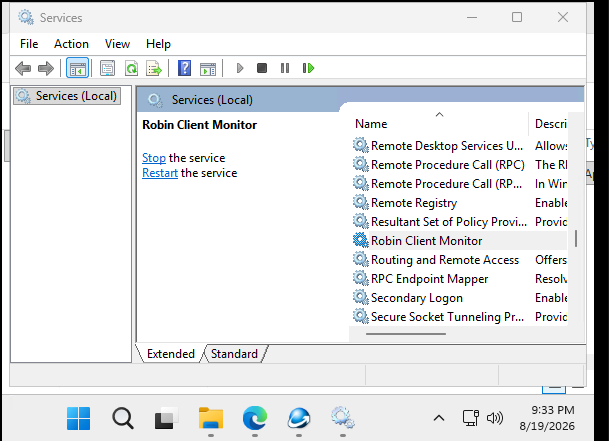

# Instalar Robin Client Monitor (Windows)

Esta guía es para quien recibe el instalador. No hace falta configurar certificados, tokens ni la línea de comandos: el administrador ya dejó eso listo en el paquete.

Si el equipo **no tiene escritorio** (servidor Linux o Windows Server Core), usa la [guía de instalación por consola](instalacion-consola.md).

**Qué vas a instalar:** un programa que se conecta al servidor de monitoreo y queda corriendo en segundo plano, también al reiniciar el PC.

**Qué debes recibir:** un solo archivo, `robin-client-monitor-setup.exe`.

---

## Antes de empezar

- Windows 10 u 11, 64 bits.
- Cuenta con permiso de **administrador** (Windows lo pedirá al iniciar).
- Conexión a internet o a la red de la empresa, según te indique quien te entregó el instalador.

Si Windows Defender o SmartScreen avisa que el origen es desconocido, elige **Más información** → **Ejecutar de todas formas** (solo si el archivo te lo dio tu administrador).

---

## Paso 1 — Abrir el instalador

1. Localiza `robin-client-monitor-setup` (puede verse sin la extensión `.exe`).
2. Haz **doble clic**.
3. Si aparece el control de cuentas de usuario (UAC), pulsa **Sí**.

---

## Paso 2 — Listo para instalar

Cuando veas **Listo para Instalar**, pulsa **Instalar**.

La carpeta por defecto es `C:\Program Files\robin-client-monitor`. No hace falta cambiarla.

---

## Paso 3 — Esperar a que termine

Verás **Instalando** y una barra de progreso (por ejemplo, copiando archivos en `C:\Program Files\robin-client-monitor\nssm\nssm.exe`).

En este momento el instalador copia el programa, crea el servicio de Windows **Robin Client Monitor** y lo arranca solo.

No cierres la ventana ni pulses **Cancelar**.

---

## Paso 4 — Finalizar

Cuando aparezca **Completando la instalación de Robin Client Monitor**, pulsa **Finalizar**.

Listo. El monitor ya está en ejecución. No hace falta abrirlo a mano ni dejar una ventana abierta.

---

## Comprobar que funciona

1. Pulsa `Win` y escribe **Servicios**.
2. Abre **Servicios**.
3. Busca **Robin Client Monitor**.
4. Debe estar seleccionado y, a la izquierda, deben aparecer **Detener el servicio** y **Reiniciar el servicio**. Eso significa que está **en ejecución**.

Si no aparece, vuelve a ejecutar el setup **como administrador**. Si aparece detenido: clic derecho → **Iniciar**.

---

## Qué no hace falta

- No ejecutes el programa a mano en el día a día.
- No cambies archivos dentro de `C:\Program Files\robin-client-monitor` (config, certificados, carpeta `enrollment`).
- No hace falta un token ni un comando de registro: eso ya viene en el instalador.

---

## Desinstalar

1. **Configuración** → **Aplicaciones** → **Aplicaciones instaladas**.
2. Busca **Robin Client Monitor**.
3. **Desinstalar**.

Eso detiene y elimina el servicio.

---

## Si algo falla

| Qué ves | Qué hacer |
|---|---|
| Windows pide administrador y cancelas | Vuelve a abrir el setup y acepta. Sin eso no se crea el servicio. |
| SmartScreen bloquea el archivo | Más información → Ejecutar de todas formas (si el archivo es de confianza). |
| El servicio no está en ejecución | Inícialo desde Servicios, o reinstala. |
| El PC no tiene red | El monitor reintenta solo cuando vuelva la conexión. |

Si el servicio corre y aun así no aparece el equipo en la consola, avisa a quien te entregó el instalador (es un tema de red o de servidor, no de estos pasos).
