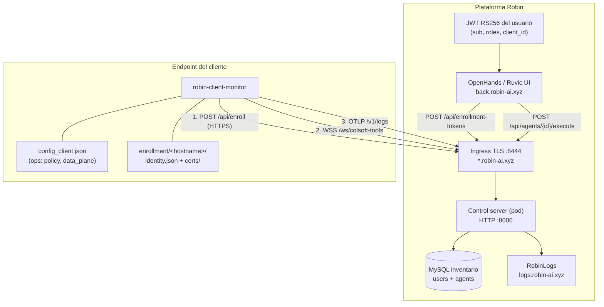

# Robin — enrollment, conexión de agentes y multi-tenant

Guía operativa para **producción en Robin** (ingress `:8444` → pod HTTP `:8000`).
Complementa [`produccion.md`](produccion.md) (JWT, mTLS clásico) y
[`empaquetado.md`](empaquetado.md) (MSI/deb).

Documentación de producto (sitio Ruvic, Mintlify):
`ruvic-documentation/site/ruvic/usage/endpoint-agents/` — install, identity, and
signature/TLS errors.

---

## 1. Piezas del sistema



| Componente | Rol |
|---|---|
| **Ingress Robin** | Termina TLS en `:8444`. El pod **no** define `SSL_*`; escucha HTTP en `:8000`. |
| **Control server** | FastAPI: REST `/api/*`, WebSocket `/ws/colsoft-tools`, OTLP `/v1/logs`. |
| **JWT Robin** | Autoriza la API REST (mint token, listar agentes, ejecutar comandos). **No** entra al WebSocket del agente. |
| **Token `enr_…`** | Autoriza **crear una identidad** (un agente, un uso). Ligado al `sub` del usuario que lo mintea. |
| **MySQL** | Persiste `user_id` ↔ `agent_id` para que `GET /api/agents` liste solo los agentes del usuario. |
| **Agente** | Identidad criptográfica en `enrollment/`; configuración operativa en `config_client.json`. |

---

## 2. Tres capas de autenticación (no mezclar)

| Capa | Cuándo | Credencial | Para qué |
|---|---|---|---|
| **JWT Robin** | Operador / OpenHands → REST | `Authorization: Bearer eyJ…` | Mint token, listar agentes, ejecutar comandos, consultar logs |
| **Token enrollment** | Primera vez en un host | `enr_…` (un solo uso) | Provisionar `agent_id`, llaves RSA, certs, `websocket_url` |
| **Handshake WebSocket** | Cada conexión del agente | Firma RSA del `auth_challenge` | Probar que el agente posee la llave de `enrollment/` |

El agente **nunca** presenta el JWT Robin al conectarse por WebSocket. El operador **nunca** pega el bundle de enrollment en `config_client.json`.

---

## 3. Despliegue del control server en Robin

Plantilla de variables: [`server/.env.robin-ingress`](../server/.env.robin-ingress).

### 3.1 Imagen y secretos

- **Dockerfile** en la raíz del project Robin (hermano de `ws_client/`).
- **En la imagen (build):** solo `signing.key` (firma Ed25519 de comandos).
- **En el pod (runtime, secret/volume):** `ca.key` + `ca.crt` de enrollment y
  `results_logs/` (tokens JSONL). La CA **no** va en el contexto Docker ni en
  la imagen: Robin monta los PEM al arrancar el pod.

```yaml
# Ejemplo de montajes en Robin (panel o manifest)
volumes:
  - ./certs/server/ca.key:/certs/enrollment/ca.key:ro
  - ./certs/server/ca.crt:/certs/enrollment/ca.crt:ro
  - ./results_logs:/app/server/results_logs
environment:
  # signing.key ya está en /certs/signing.key (Dockerfile)
  ENROLLMENT_CA_KEY: /certs/enrollment/ca.key
  ENROLLMENT_CA_CERT: /certs/enrollment/ca.crt
  ENROLL_DIR: results_logs
  ENROLLMENT_TOKENS_FILE: results_logs/enrollment_tokens.jsonl
  ENROLLMENT_TOKENS_AUTO_APPEND: 1
  ENROLLMENT_PUBLIC_HOST: tu-proyecto-p8000.robin-ai.xyz:8444
  ENROLLMENT_WS_URL: wss://{host}/ws/colsoft-tools
  ROBIN_JWT_REQUIRED: "1"
  ROBIN_API_URL: https://back.robin-ai.xyz/api
  MYSQL_HOST: ...
```

Sin montar `ca.key`/`ca.crt`, `POST /api/enroll` responde 500
(`Enrollment no configurado: faltan ENROLLMENT_CA_KEY/ENROLLMENT_CA_CERT`).

**No** definir `SSL_CERTFILE`, `SSL_KEYFILE`, `SSL_CA_CERTS` ni `SSL_CERT_REQS` en Robin: el ingress ya hace TLS.

Generar la CA offline (una vez por entorno):

```bash
python scripts/enroll.py --server-only --out-dir ./certs --san tu-proyecto-p8000.robin-ai.xyz
```

Detalle de PEMs: [`certs/server/README.md`](../certs/server/README.md).

### 3.2 URL pública del WebSocket en el bundle

Tras el enroll, el agente guarda `websocket_url` en `identity.json`. El server la arma con:

1. `ENROLLMENT_PUBLIC_HOST` (recomendado en Robin), o
2. `ENROLLMENT_TRUST_FORWARDED=1` + cabeceras `X-Forwarded-Host` / `X-Forwarded-Proto` del ingress.

Si enrollás contra `http://127.0.0.1:8000` en lab, el bundle tendrá `ws://127.0.0.1:8000/…`. En prod el enroll debe ir contra la **URL pública HTTPS del ingress**:

```text
https://<uuid>-p8000.robin-ai.xyz:8444
```

---

## 4. Flujo de enrollment (nuevo agente)

### Paso A — Operador mintea token (desde Robin / Postman / OpenHands)

Con el JWT del **dueño** del agente:

```http
POST https://<ingress>:8444/api/enrollment-tokens
Authorization: Bearer <jwt_robin>
```

Respuesta (ejemplo):

```json
{
  "token": "enr_quhTCa4QYpKP2elLViTMPQ-ZjKP7jxFh",
  "expires_at": "2026-09-03T21:58:26.404740+00:00",
  "user_id": "4f5b34c4-efda-4b5b-a5ea-d32ef09970d5"
}
```

El token queda registrado en `results_logs/enrollment_issued.json` y, si está configurado, en `enrollment_tokens.jsonl` (persiste reinicios del pod).

Postman: carpeta **0. Setup → Mint enrollment token (JWT)** en
[`Robin-Client-Monitor.postman_collection.json`](postman/Robin-Client-Monitor.postman_collection.json).

### Paso B — Instalación en el endpoint

En la máquina nueva (Windows/Linux), con el binario o instalador:

```bash
# Linux (ejemplo) — ingress público (Let's Encrypt): no pases --enroll-ca.
# certs/ca.crt firma agentes, no el TLS del ingress.
robin-client-monitor \
  --enroll enr_quhTCa4QYpKP2elLViTMPQ-ZjKP7jxFh \
  --enroll-server https://<uuid>-p8000.robin-ai.xyz:8444 \
  --enroll-name PC_Windows_Prod
```

Windows (PowerShell, tras instalar):

```powershell
& "C:\Program Files\robin-client-monitor\robin-client-monitor.exe" `
  --enroll enr_... `
  --enroll-server https://<uuid>-p8000.robin-ai.xyz:8444 `
  --enroll-name PC_Windows_Prod
```

Parámetros útiles:

| Flag | Uso |
|---|---|
| `--enroll-server` | Base HTTPS del control (ingress `:8444`). |
| `--enroll-name` | Nombre del host (`client_name`); define carpeta bajo `enrollment/`. |
| `--enroll-ca` | Pin de CA **solo** en lab interno. No usarlo contra ingress público. |
| `--enroll-dir` | Carpeta destino explícita (opcional). |

**No hace falta Bearer JWT** en el CLI si el token fue emitido con JWT: el `user_id` ya va ligado al token.

### Paso C — Qué se escribe en el host

```
/opt/robin-client-monitor/          (o C:\Program Files\robin-client-monitor\)
├── config_client.json              ← policy, data_plane, monitores (sin llaves)
└── enrollment/
    ├── active.json                 ← puntero a la identidad activa
    └── PC_Windows_Prod/
        ├── identity.json           ← agent_id, websocket_url, rutas a PEM
        └── certs/
            ├── identity.key        ← firma auth_challenge (RSA)
            ├── identity.pub
            ├── agent.crt / agent.key
            ├── ca.crt
            └── signing.pub           ← verifica comandos Ed25519 del server
```

`active.json` ejemplo:

```json
{
  "identity_dir": "PC_Windows_Prod",
  "client_name": "PC_Windows_Prod",
  "agent_id": "agt_pc_windows_prod_a4e801"
}
```

El server registra en MySQL: `agent_id` + `client_name` + **`user_id` del token**.

### Paso D — Arranque normal (sin `--enroll`)

El servicio arranca el binario **sin** flags de enrollment. El agente:

1. Lee `config_client.json` (telemetría, policy, `data_plane`, etc.).
2. Resuelve identidad: `enrollment/active.json` → `enrollment/<nombre>/identity.json`.
3. Mezcla identidad sobre config (llaves, `agent_id`, `websocket_url`, certs).

Orden de resolución: `--identity-dir` → `ROBIN_IDENTITY_DIR` → `identity_dir` en config → `active.json` → `enrollment/<client_name>/`.

---

## 5. Cómo se conecta el agente (runtime)

### 5.1 Plano de control — WebSocket

```text
wss://<ingress>:8444/ws/colsoft-tools?client_name=PC_Windows_Prod&agent_id=agt_pc_windows_prod_a4e801
```

Secuencia:

1. **TLS** hasta el ingress Robin (`:8444`).
2. El pod acepta el WebSocket en HTTP.
3. Server envía `auth_challenge` (UUID).
4. Agente responde `auth_response` con `public_key` + firma RSA-SHA256 del desafío.
5. Server confirma `auth_ack` con el `agent_id` resuelto.
6. Heartbeats, `command_request` (firmados Ed25519), `command_response`, `event_push`.

En Robin **sin mTLS en el pod**, `config_client.json` suele llevar `"allow_insecure_ws": true`: el canal va cifrado por TLS del ingress, pero el pod no exige certificado de cliente en el socket HTTP interno. Los PEM de `enrollment/certs/` siguen existiendo (identidad + posible mTLS en despliegues alternativos).

### 5.2 Plano de datos — OTLP

Telemetría batch (no pasa por el WebSocket):

```json
"data_plane": {
  "enabled": true,
  "endpoint": "https://<ingress>:8444/v1/logs"
}
```

Misma base URL que el control; el server reenvía telemetría según [`agent-telemetry.md`](agent-telemetry.md).

### 5.3 Comandos remotos — REST + firma

Operador (OpenHands, Postman, integración propia):

```http
POST https://<ingress>:8444/api/agents/agt_pc_windows_prod_a4e801/execute
Authorization: Bearer <jwt_robin>
Content-Type: application/json

{"command": "health_check", "params": {}}
```

El server firma el `command_request` con `SERVER_SIGNING_KEY` (Ed25519). El agente valida contra `signing.pub` del enrollment.

---

## 6. Multi-tenant: varios agentes por usuario

| Acción | Endpoint | Scope |
|---|---|---|
| Mint token | `POST /api/enrollment-tokens` | Un token = un agente nuevo |
| Enroll | `POST /api/enroll` | Consume token; crea `agt_*` |
| Listar | `GET /api/agents` | Solo agentes cuyo `user_id` coincide con JWT `sub` |
| Ejecutar | `POST /api/agents/{agent_id}/execute` | JWT + RBAC por `roles` |

Cada máquina = un enroll con token nuevo. Mismo usuario puede tener `PC_Linux_01`, `PC_Windows_02`, etc.; todos aparecen en `GET /api/agents` con su JWT.

El `agent_id` estable es **`agt_<sanitized_name>_<hex>`** (no confundir con el UUID de sesión `client_name-xxxx` ni con `agentId` de RobinLogs).

---

## 7. Lab local vs Robin prod

| | Lab (`127.0.0.1:8000`) | Robin prod |
|---|---|---|
| Enroll URL | `http://127.0.0.1:8000` | `https://…robin-ai.xyz:8444` |
| `websocket_url` en bundle | `ws://127.0.0.1:8000/…` | `wss://…robin-ai.xyz:8444/…` |
| TLS en pod | No | No (ingress) |
| JWT REST | `ROBIN_JWT_REQUIRED=1` (opcional) | `1` obligatorio |
| Tokens | Mint local o `ENROLLMENT_TOKENS` | JSONL en volumen `results_logs/` |
| CA enrollment | `ENROLLMENT_CA_*` en `server/.env` | Montadas en el pod |

---

## 8. Checklist operativo

**Server (Robin panel)**

- [ ] Build con `signing.key` en contexto (`ws_client/certs/server/signing.key`)
- [ ] **Volumen/secret:** `ca.key` + `ca.crt` → `/certs/enrollment/` (runtime)
- [ ] Volumen `results_logs/` → `/app/server/results_logs`
- [ ] `ENROLLMENT_PUBLIC_HOST=<host>:8444` (URL del ingress)
- [ ] `ROBIN_JWT_REQUIRED=1`, `MYSQL_*` configurados
- [ ] Sin `SSL_*` en el pod

**Por cada agente nuevo**

- [ ] Mint token con JWT del dueño
- [ ] `--enroll` contra URL **pública** del ingress
- [ ] Verificar `enrollment/active.json` y `identity.json`
- [ ] `config_client.json` con `data_plane.endpoint` apuntando al ingress
- [ ] Servicio arrancado; en logs: `auth_ack` + `agent_id`
- [ ] `GET /api/agents` con el mismo JWT muestra el agente

**Errores frecuentes**

| Error | Causa |
|---|---|
| `faltan ENROLLMENT_CA_KEY/ENROLLMENT_CA_CERT` | CA no montada en el pod (solo va en runtime, no en imagen) |
| `Token inválido o ya utilizado` | Token consumido (re-mintear) |
| Agente conecta a `127.0.0.1` en prod | Enroll hecho contra lab; re-enroll con URL ingress |
| `GET /api/agents` vacío | JWT de otro usuario o MySQL sin fila de owner |

---

## 9. Referencias

- Postman: [`docs/postman/`](postman/)
- Env servidor: [`.env.example`](../.env.example), [`server/.env.robin-ingress`](../server/.env.robin-ingress)
- Config agente: [`README_CONFIG.md`](../README_CONFIG.md)
- Instalación: [`instalacion-consola.md`](instalacion-consola.md), [`instalacion-windows-usuario.md`](instalacion-windows-usuario.md)
